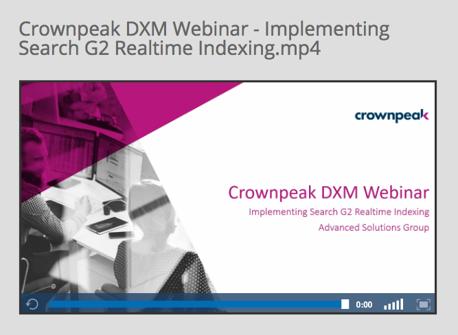

<a href="http://www.crownpeak.com" target="_blank"></a>

# Crownpeak Search G2 Realtime Indexing Best Practice Examples

CrownPeak Search's Realtime Indexing provides a direct connection between the CrownPeak CMS & CrownPeak Search. This enables you to build Assets within the CrownPeak CMS for delivery directly to CrownPeak Search upon publication.

Realtime Indexing provides the following advantages:

* Time-critical publications where traditional website crawling is too infrequent for content updates.
* Storing and returning items that otherwise don't need pages that are published to the delivery environment (e.g. office locations when taking advantage of CrownPeak Search's geo-location capability).
* Indexing & querying protected content that cannot be deployed to the delivery environment for security reasons.
* Choosing not to use site crawling at all.

_NOTE: When using Realtme Indexing, if you additionally use the Search G2 Crawler to obtain content from another source, you should use a separate Search G2 Collection, and NOT share with content that is sourced from a crawl operation._

***

## Crownpeak DXM Webinar - Implementing Search G2 Realtime Indexing
Released in January 2017, the Crownpeak DXM Webinar - Implementing Search G2 Realtime Indexing, gives a comprehensive walk through of how to use the Crownpeak CMS to publish content directly to Search G2, using Realtime Indexing.

<a href="http://crownpeak.vzaar.me/8975065" target="_blank">
</a>

***

## Configuring Crownpeak Search G2 Realtime Indexing

To configure Search G2 Realtime Indexing, the Search G2 CMS Connector must be enabled. This connector links the CMS to each Search G2 Collection that you manage. Connectors must be configured initially by Crownpeak Support. Raise a ticket, or send an email to support@crownpeak.com.

Once the Search G2 CMS Connector has been configured, you need to update your CMS Publishing Packages to select which Search G2 CMS Connector to use for deployment (see image below):


Finally, configure Search G2 CMS Realtime Indexing Templates to define which data to publish to Search G2 during the publish operation.

### Search G2 CMS Realtime Indexing CMS Templates

There are 3 Templates that you can configure in order to use Search G2 Realtime Indexing:

* search\_g2\_insert.aspx - This is fired first time an Asset is published;
* search\_g2\_update.aspx - This is fired for subsequent updates to an existing Asset;
* search\_g2\_delete.aspx - This is fired for delete request for an existing Asset.

Example of a Search G2 CMS Realtime Indexing Insert Template file:

```
<%@ Page Language="C#" Inherits="CrownPeak.Internal.Debug.SearchG2Init" %>
<%@ Import Namespace="CrownPeak.CMSAPI" %>
<%@ Import Namespace="CrownPeak.CMSAPI.Services" %>
<!--DO NOT MODIFY CODE ABOVE THIS LINE-->
<%@ Import Namespace="Search_G2.Project.Library" %>
<% //MODIFY or ADD Import Statements to Define Namespaces Used by the Template %>
<%//This plugin uses SearchG2Context as its context class type%>
<%
	SearchG2Helper.UpdateSearchG2(SearchG2JsonParams.OperationType.Create, asset, context);
%>
```

Example of a Search G2 CMS Realtime Indexing Update Template file:

```
<%@ Page Language="C#" Inherits="CrownPeak.Internal.Debug.SearchG2Init" %>
<%@ Import Namespace="CrownPeak.CMSAPI" %>
<%@ Import Namespace="CrownPeak.CMSAPI.Services" %>
<!--DO NOT MODIFY CODE ABOVE THIS LINE-->
<%@ Import Namespace="Search_G2.Project.Library" %>
<% //MODIFY or ADD Import Statements to Define Namespaces Used by the Template %>
<%//This plugin uses SearchG2Context as its context class type%>
<%
	SearchG2Helper.UpdateSearchG2(SearchG2JsonParams.OperationType.Update, asset, context);
%>
```

Example of a Search G2 CMS Realtime Indexing Delete Template file:

```
<%@ Page Language="C#" Inherits="CrownPeak.Internal.Debug.SearchG2Init" %>
<%@ Import Namespace="CrownPeak.CMSAPI" %>
<%@ Import Namespace="CrownPeak.CMSAPI.Services" %>
<!--DO NOT MODIFY CODE ABOVE THIS LINE-->
<%@ Import Namespace="Search_G2.Project.Library" %>
<% //MODIFY or ADD Import Statements to Define Namespaces Used by the Template %>
<%//This plugin uses SearchG2Context as its context class type%>
<%
SearchG2Helper.UpdateSearchG2(SearchG2JsonParams.OperationType.Delete, asset, context);
%>
```

In the example above, we are calling a method on the SearchG2Helper class. This class is pasted below for reference. _NOTE: You should alter this to match your implementation requirements._

```
using System;
using System.Collections.Generic;
using System.Linq;
using System.Text;
using CrownPeak.CMSAPI;
using CrownPeak.CMSAPI.Services;
/* Some Namespaces are not allowed. */
namespace Search_G2.Project.Library
{
  public static class SearchG2Helper
  {
    public static void UpdateSearchG2(SearchG2JsonParams.OperationType type, Asset asset,
                                     SearchG2Context context)
    {
      var doc = new SearchG2JsonParams
      {
        Id = asset.BranchId.ToString(),
        Operation = type,
        Overwrite = true
      };
      
      if (type != SearchG2JsonParams.OperationType.Delete)
      {
      	asset.GetContent();
        
        doc.Add("custom_i_asset_id", AssetPropertyNames.Id);
        doc.Add("custom_i_template_id", AssetPropertyNames.TemplateId);
        doc.Add("custom_s_template_label", AssetPropertyNames.TemplateLabel);
        
        doc.AddFixed("custom_s_url", GetLink(asset, context, true));
        doc.AddFixed("custom_s_local_url", GetLink(asset, context));
        
        switch (asset.TemplateLabel)
        {
          case "News Article":
            UpdateNewsArticle(doc, asset, context);
            break;
            // TODO: Other supported templates will go here
        }
        
        doc.AddFixedIfMissing("custom_s_content_type", "text/html");
        doc.AddIfMissing("custom_dt_created", AssetPropertyNames.CreateDate);
        doc.AddIfMissing("custom_dt_modified", AssetPropertyNames.ModifiedDate);
        doc.AddFixedIfMissing("custom_dt_published", DateTime.UtcNow.ToString("o"));
        var title = asset["html_title"];
        if (string.IsNullOrWhiteSpace(title)) title = asset["meta_title"];
        if (string.IsNullOrWhiteSpace(title)) title = asset.Label;
        doc.AddFixedIfMissing("title", title);
        doc.AddFixedIfMissing("custom_s_title", title);
        doc.AddFixedIfMissing("content", Util.StripHtml(asset.Show()));
      }
      
      context.JsonParams.Add(doc);
      
      Util.Log(asset, "Search G2 {0} operation: {1}", type, context.GetJson());
    }
    
    private static void UpdateNewsArticle(SearchG2JsonParams doc, Asset asset, SearchG2Context context)
    {
      doc.AddFixed("custom_s_type", "News Article");
      doc.Add("title", "headline");
      doc.AddFixed("content", Util.StripHtml(asset["body"]));
      doc.Add("custom_s_article_type", "article_type");
      doc.Add("custom_dt_date", "date");
      doc.Add("custom_s_headline", "headline");
      doc.Add("custom_s_precis", "precis");
    }
    
    private static string GetLink(Asset asset, SearchG2Context context, bool includeDomain = false)
	{
		return Util.ReplaceCptInternals(Util.ReplaceAttachments(asset.GetLink(includeDomain)));
	}
    
    #region Extension Helper Methods
	private static bool IsFieldSet(this SearchG2JsonParams doc, string jsonName)
	{
		return doc.Fields.Any(f => f.Key == jsonName) || doc.Fixeds.Any(f => f.Key == jsonName);
	}

	public static void AddIfMissing(this SearchG2JsonParams doc, string jsonName, AssetPropertyNames value)
	{
		if (!doc.IsFieldSet(jsonName)) doc.Add(jsonName, value);
	}

	public static void AddIfMissing(this SearchG2JsonParams doc, string jsonName, string value)
	{
		if (!doc.IsFieldSet(jsonName)) doc.Add(jsonName, value);
	}

	public static void AddFixedIfMissing(this SearchG2JsonParams doc, string jsonName, string value)
	{
		if (!doc.IsFieldSet(jsonName)) doc.AddFixed(jsonName, value);
	}

	public static void AddFixedIfMissing(this SearchG2JsonParams doc, string jsonName, IEnumerable<string> values)
	{
		if (!doc.IsFieldSet(jsonName)) doc.AddFixed(jsonName, values);
	}

	public static void AddFixedIfMissing(this SearchG2JsonParams doc, string jsonName, params string[] values)
	{
		if (!doc.IsFieldSet(jsonName)) doc.AddFixed(jsonName, values);
	}
	#endregion
  }
}
```

_NOTE: All string fields are limited to 32KB of data, the Crownpeak Search G2 Realtime Indexing enhancement will automatically truncate any field values to 32KB, if the value is larger._

### Logging Search G2 Realtime Indexing Actions

A record is added to the System Log under 'Custom' in the Action filter when an asset is sent for Realtime Indexing.  This log can be viewed under Reports > Audit > System (see below):


***
## Binary Content Enhancement

The Crownpeak Search G2 Binary Content Enhancement allows the metadata & content from a Binary Asset (e.g. PDF, Microsoft Office) to be extracted, in order for it to be passed into a Search G2 Collection during Realtime Indexing.

When a Binary Asset is uploaded to the Crownpeak CMS, the file is passed to our Content Extraction Service, which stores the returned metadata & content string against the Binary Asset. There is also a just-in-time function to synchronously extract the data during Realtime Indexing publishing, in the event of it not having been previously stored - this is useful for use-cases where this feature is retro-fitted into an application, without the need to re-upload all Binary Assets.

Assuming that are using Input.ShowAcquireDocument("Pick a document", "document”); in your input.aspx Template File, then you could use the following code to store the metadata & content from the Binary Asset within a Realtime Indexing Template file:

```
var document = Asset.Load(asset["document"]);
if (document.IsLoaded)
{
	var extractedContent = document.ExtractedContent;
	if (extractedContent != null)
	{
		doc.AddFixed("content", extractedContent.Content);

		var metadata = extractedContent.Metadata;
		if (metadata != null)
		{
			if (metadata.ContainsKey("meta:author"))
			{
				// NOTE: these values are usually strings, but can sometimes be arrays of strings
				// depending on the source document and the property
				var value = metadata["meta:author"] as string;
				if (value != null)
					doc.AddFixed("custom_s_author", value);
			}
			if (metadata.ContainsKey("meta:creation-date"))
			{
				var value = metadata["meta:creation-date"] as string;
				if (value != null)
					doc.AddFixed("custom_dt_created", value);
			}
			if (metadata.ContainsKey("Last-Modified"))
			{
				var value = metadata["Last-Modified"] as string;
				if (value != null)
					doc.AddFixed("custom_dt_modified", value);
			}
		}
	}
}
```

***

## Disclaimer

THIS SITE IS EXPERIMENTAL AND MAY BE REMOVED AT ANY TIME.

THIS SOFTWARE IS PROVIDED "AS-IS," WITHOUT ANY EXPRESS OR IMPLIED WARRANTY.

IN NO EVENT SHALL CROWNPEAK TECHNOLOGY BE HELD LIABLE FOR ANY DAMAGES ARISING FROM THE USE OF THE SOFTWARE.

THIS SOFTWARE IS DISTRIBUTED IN THE HOPE THAT IT WILL BE USEFUL, BUT WITHOUT ANY WARRANTY; WITHOUT EVEN THE IMPLIED WARRANTY OF MERCHANTABILITY OR FITNESS FOR A PARTICULAR PURPOSE. THERE IS NO WARRANTY FOR THE SOFTWARE, TO THE EXTENT PERMITTED BY APPLICABLE LAW. EXCEPT WHEN OTHERWISE STATED IN WRITING THE COPYRIGHT HOLDERS (INCLUDING BOTH CROWN PEAK TECHNOLOGY AND THE VARIOUS THIRD PARTY COPYRIGHT HOLDERS PROVIDE THE SOFTWARE "AS IS" WITHOUT WARRANTY OF ANY KIND, EITHER EXPRESSED OR IMPLIED, INCLUDING, BUT NOT LIMITED TO, THE IMPLIED WARRANTIES OF MERCHANTABILITY AND FITNESS FOR A PARTICULAR PURPOSE. THE ENTIRE RISK AS TO THE QUALITY AND PERFORMANCE OF THE SOFTWARE IS WITH YOU, THE USER. SHOULD THE SOFTWARE PROVE DEFECTIVE, YOU ASSUME THE COST OF ALL NECESSARY SERVICING, REPAIR OR CORRECTION. IN NO EVENT UNLESS REQUIRED BY APPLICABLE LAW OR AGREED TO IN WRITING WILL ANY COPYRIGHT HOLDER, BE LIABLE TO YOU FOR DAMAGES, INCLUDING ANY GENERAL, SPECIAL, INCIDENTAL OR CONSEQUENTIAL DAMAGES ARISING OUT OF THE USE OR INABILITY TO USE THE SOFTWARE (INCLUDING BUT NOT LIMITED TO LOSS OF DATA OR DATA BEING RENDERED INACCURATE OR LOSSES SUSTAINED BY YOU OR THIRD PARTIES OR A FAILURE OF THE SOFTWARE TO OPERATE WITH ANY OTHER PROGRAMS), EVEN IF SUCH HOLDER HAS BEEN ADVISED OF THE POSSIBILITY OF SUCH DAMAGES.